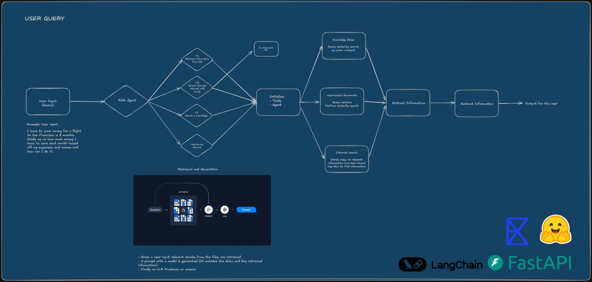

# Claw et al.

- Lightweight RAG backend for machine learning research material.
- Parses PDFs, embeds chunks, stores vectors, and answers user queries through an agentic API.

## Embeddings

- Uses `BAAI/bge-small-en-v1.5`.
- Embeds parsed PDF chunks into 384-dimensional vectors.
- Stores vectors with pgvector for semantic search.

## FastAPI

- Defines the backend API.
- Handles document ingestion, knowledge ingestion, and user queries.
- Returns answers with reasoning and sources.

## LangChain / LangGraph

- LangChain handles document loading, splitting, embeddings, and tools.
- LangGraph/DeepAgents powers the agent workflow.
- The agent chooses between curated knowledge, uploaded documents, and external search.

## Exa

- Used for external research search.
- Called when local retrieval is not enough.
- Restricted to research-oriented sources such as arXiv, Figshare, and Lightning AI.

## Note

> *Built by hand in a short period during exams. Some production upgrades were intentionally left out, such as stronger parsing, larger embeddings, and more advanced agent workflows.*